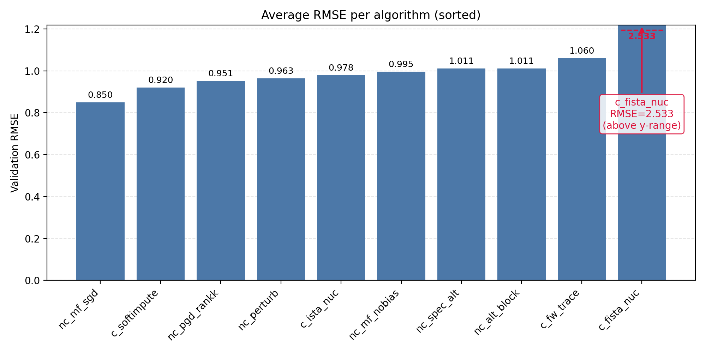
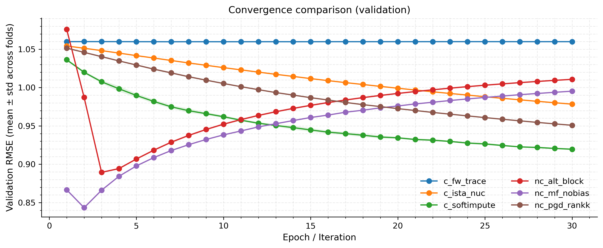
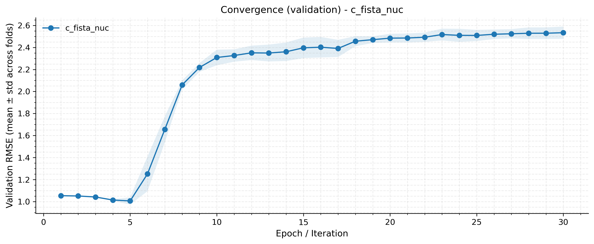
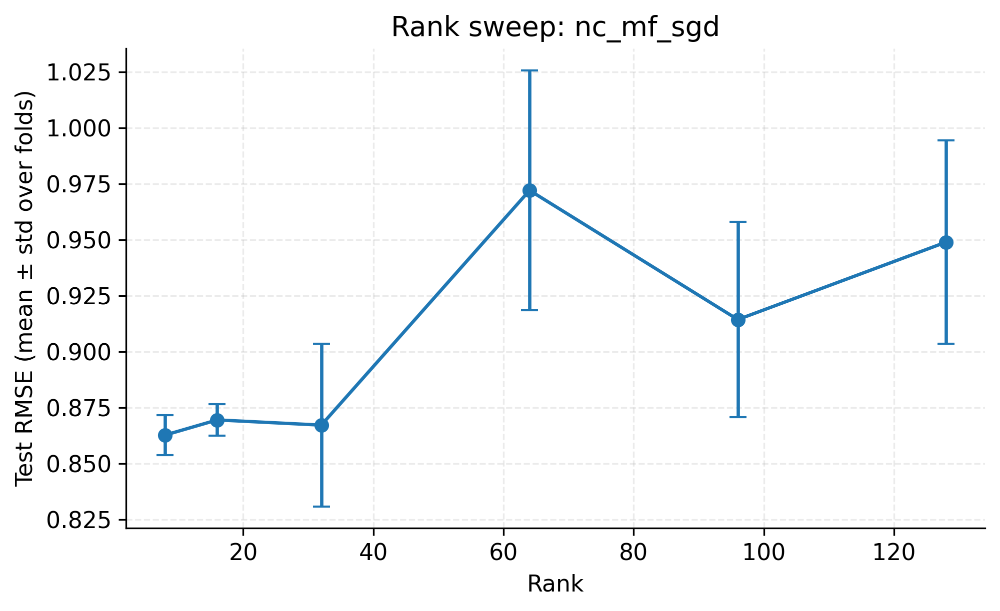

# HW2: Low-Rank Matrix Completion on MovieLens-10M

## 📌 项目概览
- 数据：MovieLens 20M 的 10M 子集，5 折交叉验证（seed=0）。
- 目标：比较凸方法与至少一种非凸低秩矩阵填充方法，评价指标为 RMSE。
- 产出：RMSE 明细表与柱状图、收敛曲线、rank 扫描曲线、复现实验脚本。

## 📊 数据与划分（`code/prepare_folds_hash.py`）
- 统计（`result/folds_hash_ml_10m/meta.json`）：`n_users=69878`，`n_items=10677`，`n_ratings=10000054`，`k=5`，`seed=0`。
- 划分：对键 `seed:uid:mid:ts` 做 blake2b 哈希并对 k 取模，保证每条评分唯一落入某折；用户/物品重映射为稠密索引，输出 `fold{i}.txt`（`u_idx \t i_idx \t rating`）和 `meta.json`。
- 理论支撑：哈希分折近似均匀随机划分，减小人为偏置；稠密映射便于稀疏矩阵运算。

## ⚙️ 训练与主要参数
- 通用：`device=cuda`，`batch_size=131072`，`seed=42`，`shuffle_chunk=1e6`。
- 非凸 MF：`rank_mf=64`，`epochs_mf=30`，`lr_mf≈0.02`（文件写作 `Ir_mf`），`reg_mf=0.02`，`reg_bias=0.005`。
- PGD/扰动/谱初始化：`rank_pgd=32`，`iters_pgd=30`，`eta_pgd=0.2`。
- 凸方法（核/迹范数）：`rank_cvx=32`，`iters_softimpute=30`，`lam_softimpute=0.5`；`iters_ista=30`，`lam_ista=0.5`，`eta_ista=0.1`；`iters_fista=30`，`lam_fista=0.5`，`eta_fista=0.1`；`iters_fw=30`，`tau_fw=50`。

## 🧠 算法与数学模型

### 📐 1. 核心模型：矩阵分解 (Matrix Factorization)
我们的目标是补全稀疏评分矩阵，在非凸设定下，优化目标包含预测误差与正则项：

$$
\min_{U,V,b_u,b_i} \sum_{(u,i)\in\Omega} (r_{ui} - \mu - b_u - b_i - U_u^\top V_i)^2 + \lambda \left( \|U\|_F^2 + \|V\|_F^2 + \|b_u\|_2^2 + \|b_i\|_2^2 \right)
$$

**公式含义说明：**
*   $\Omega$：观测到的评分集合 (用户, 物品)。
*   $r_{ui}$：用户 $u$ 对物品 $i$ 的真实评分。
*   $\mu$：全局平均评分（Global Bias）。
*   $b_u, b_i$：用户偏置项与物品偏置项，用于捕捉个体差异。
*   $U_u, V_i$：用户与物品的 $k$ 维隐向量（Latent Vectors），$U_u^\top V_i$ 拟合交互分数。
*   $\lambda$：正则化系数，用于约束参数范数，防止过拟合。

### 💻 2. 已实现算法 (Implemented Algorithms)

本项目包含两类主要方法：基于低秩分解的**非凸方法** (Non-convex) 与基于核范数的**凸优化方法** (Convex)。

#### 📉 非凸方法 (Non-Convex / Factorization)
> 直接对低秩因子 $U, V$ 进行优化，计算效率高，适合大规模数据。

*   **基础分解类**
    *   **`nc_mf_sgd`**: 标准矩阵分解（带 $b_u, b_i$ 偏置），使用 SGD/Adam 优化。
    *   **`nc_mf_nobias`**: 无偏置矩阵分解，仅保留核心交互项，用于纯粹的秩分析。
*   **交替更新与初始化**
    *   **`nc_alt_block`**: 交替最小二乘 (ALS) 风格的块更新策略。
    *   **`nc_spec_alt`**: **两阶段法**。先使用**谱初始化 (Spectral Init)** 寻找优质起点，再进行交替优化，收敛更稳。
*   **优化景观探索 (Landscape)**
    *   **`nc_perturb`**: 扰动梯度下降。在损失平台期添加随机噪声，辅助模型**跳出鞍点**。
    *   **`nc_pgd_rankk`**: 投影梯度下降 (PGD)。梯度步后执行截断 SVD，显式强制 $\text{rank}(X) \le k$。

#### 🔮 凸方法 (Convex / Nuclear Norm)
> 使用核范数 $\|X\|_*$ 作为秩的凸松弛，理论上保证全局最优。

*   **`c_softimpute`**: **Soft-Impute**。经典的“填充+SVT”迭代，通过奇异值软阈值算子求解。
*   **`c_ista_nuc` / `c_fista_nuc`**: 近端梯度下降及其加速版 (FISTA)。结合了梯度下降与软阈值投影，FISTA 利用动量加速收敛。
*   **`c_fw_trace`**: **Frank-Wolfe** 算法。在迹范数球约束下，每一步贪心地添加一个 Rank-1 原子 (Top-1 奇异向量)。

### 📝 理论要点
*   **凸方法**：核范数是秩函数的最佳凸逼近，能获得全局最优解，但计算 SVD 成本较高。
*   **非凸方法**：在过参数化 (Over-parameterization) 设定下，非凸分解的局部极小值往往接近全局最优，且在工程实践中通常能达到更低的 RMSE 和更高的计算效率。

## 🏆 评测结果（5-fold RMSE）
- 按 fold 列出（`result.md`）：  

| 算法 | fold0 | fold1 | fold2 | fold3 | fold4 | 平均 |
| --- | --- | --- | --- | --- | --- | --- |
| nc_mf_sgd | 0.849600 | 0.849226 | 0.852479 | 0.846997 | 0.849657 | 0.849592 |
| nc_mf_nobias | 0.994698 | 0.994905 | 0.994236 | 0.995663 | 0.996185 | 0.995138 |
| nc_alt_block | 1.008974 | 1.010255 | 1.013081 | 1.011472 | 1.011392 | 1.011035 |
| nc_spec_alt | 1.010109 | 1.011623 | 1.010568 | 1.010884 | 1.011460 | 1.010929 |
| nc_perturb | 0.961587 | 0.963892 | 0.961686 | 0.963618 | 0.965574 | 0.963271 |
| nc_pgd_rankk | 0.950953 | 0.950755 | 0.950997 | 0.951609 | 0.950161 | 0.950895 |
| c_softimpute | 0.918405 | 0.921495 | 0.920001 | 0.918319 | 0.919555 | 0.919555 |
| c_ista_nuc | 0.978705 | 0.978900 | 0.979133 | 0.978328 | 0.976960 | 0.978405 |
| c_fista_nuc | 2.437001 | 2.573143 | 2.576045 | 2.502314 | 2.576237 | 2.532948 |
| c_fw_trace | 1.059627 | 1.059476 | 1.060222 | 1.060281 | 1.059845 | 1.059890 |

- 平均值柱状图（按 RMSE 升序，`c_fista_nuc` 超轴标注）：  
  

- 结果含义与理论支持：  
  - `nc_mf_sgd` 最佳：非凸 MF 贴合低秩结构；经验与理论表明在足够维度和良好初始化下局部极小接近最优。  
  - `c_softimpute` 次优：核范数凸替代带来全局最优与去噪，稳健但可能欠拟合细节。  
  - `nc_pgd_rankk`：投影保证低秩先验，略弱于 MF，暗示步长/秩/初始化可进一步调优。  
  - `nc_perturb`：扰动可避开鞍点，但当前超参未带来额外收益。  
  - `c_fw_trace`：FW 子线性收敛且每步只加 rank-1 原子，导致精度有限。  
  - `c_fista_nuc`：RMSE 很高，动量+步长未满足 FISTA 收敛条件；凸理论保证收敛，但需 Lipschitz 步长或线搜索。  
  - `nc_mf_nobias` / `nc_alt_block` / `nc_spec_alt`：无偏置或弱初始化导致欠拟合，验证了偏置项与谱初始化的重要性。

## 📉 收敛性对比
- 汇总（30 轮完整日志，过滤短曲线）：`convergence_val_rmse.png`  
    
  - `c_softimpute` 单调下降且最低，近端软阈值保证稳定收敛；  
  - `nc_pgd_rankk` 稳定下降，投影维持低秩先验；  
  - `c_fw_trace` 基本平坦，FW 子线性收敛；  
  - `nc_alt_block` 先快降后回升，提示可能过拟合或步长偏大；  
  - `nc_mf_nobias` 低起点后上升，缺少偏置导致欠拟合；  
  - `c_ista_nuc` 缓慢下降，步长保守但稳定；  
  - 理论：近端/PGD/ISTA 在步长满足 Lipschitz 条件时单调下降，FW 子线性收敛；回升/平坦是调参信号。
- `c_fista_nuc` 单独：`convergence_val_rmse_c_fista_nuc.png`  
    
  - 波动且高位，动量叠加在不合适步长下失去理论收敛保障，需减小步长或启用线搜索。

## 🔍 超参数敏感性（rank 扫描）
- `rmse_vs_rank_nc_mf_sgd.png`：rank 10–20 最佳，过高 rank RMSE 上升且方差增大，过拟合迹象。  
  
- `rmse_vs_rank_nc_perturb.png`：低 rank 最优，rank 增大趋于变差。  
  
- `rmse_vs_rank_nc_spec_alt.png`：RMSE 随 rank 单调上升，建议保持较低 rank。  
  
- 理论意义：低秩约束是协同过滤的结构先验；rank 过高削弱先验、增加估计方差并诱发过拟合。

## 🚀 复现实验
1) 数据划分  
```bash
python code/prepare_folds_hash.py --ratings /path/to/ratings.dat --out_dir result/folds_hash_ml_10m --k 5 --seed 0
