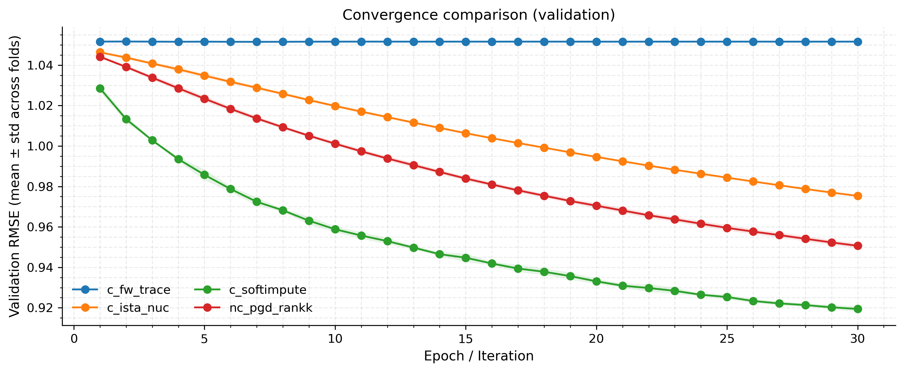
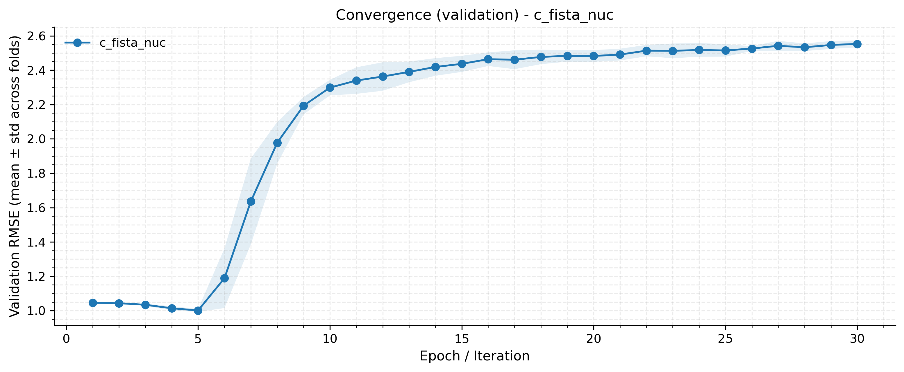
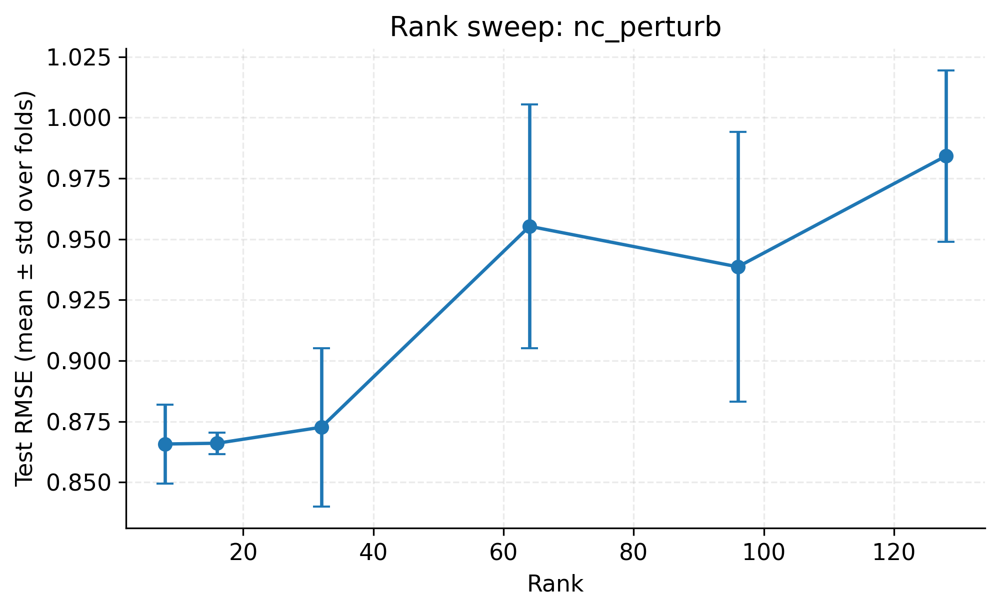

# Low-Rank Matrix Completion Experiments (MovieLens 10M & 20M)

## 📐 核心数学模型 (Mathematical Model)

本项目中矩阵分解（Matrix Factorization）的核心优化目标如下：

$$
\min_{U,V,b_u,b_i} \sum_{(u,i)\in\Omega} \left(r_{ui} - \mu - b_u - b_i - U_u^\top V_i\right)^2 + \lambda \left(\|U\|_F^2 + \|V\|_F^2 + \|b_u\|_2^2 + \|b_i\|_2^2\right)
$$

**公式含义说明：**

*   **$\Omega$**: 观测到的评分集合 (用户, 物品)。
*   **$r_{ui}$**: 用户 $u$ 对物品 $i$ 的真实评分。
*   **$\mu$**: 全局平均评分 (Global Bias)。
*   **$b_u, b_i$**: 用户偏置项与物品偏置项，用于捕捉个体差异。
*   **$U_u, V_i$**: 用户与物品的 $k$ 维隐向量 (Latent Vectors)，$U_u^\top V_i$ 拟合交互分数。
*   **$\lambda$**: 正则化系数，用于约束参数范数，防止过拟合。

---

# 🎬 Part 1: HW2 - Low-Rank Matrix Completion on MovieLens-10M

## 📌 项目概览
- **数据**：MovieLens 20M 的 10M 子集，5 折交叉验证（seed=0）。
- **目标**：比较凸方法与至少一种非凸低秩矩阵填充方法，评价指标为 RMSE。
- **产出**：RMSE 明细表与柱状图、收敛曲线、rank 扫描曲线、复现实验脚本。

## 📊 数据与划分
- **统计**：`n_users=69878`，`n_items=10677`，`n_ratings=10000054`，`k=5`，`seed=0`。
- **划分方法**：对键 `seed:uid:mid:ts` 做 blake2b 哈希并对 k 取模，保证每条评分唯一落入某折；用户/物品重映射为稠密索引。
- **理论支撑**：哈希分折近似均匀随机划分，减小人为偏置；稠密映射便于稀疏矩阵运算。

## ⚙️ 训练与主要参数
- **通用**：`device=cuda`，`batch_size=131072`，`seed=42`。
- **非凸 MF**：`rank_mf=64`，`epochs_mf=30`，`lr_mf≈0.02`，`reg_mf=0.02`，`reg_bias=0.005`。
- **PGD/扰动/谱初始化**：`rank_pgd=32`，`iters_pgd=30`，`eta_pgd=0.2`。
- **凸方法（核/迹范数）**：
    - `rank_cvx=32`，`iters_softimpute=30`，`lam_softimpute=0.5`
    - `iters_ista=30`，`lam_ista=0.5`，`eta_ista=0.1`
    - `iters_fista=30`，`lam_fista=0.5`，`eta_fista=0.1`
    - `iters_fw=30`，`tau_fw=50`

## 🧠 算法实现 (Implemented Algorithms)

### 📉 非凸方法 (Non-Convex / Factorization)
> 直接对低秩因子 $U, V$ 进行优化，计算效率高，适合大规模数据。

*   **基础分解类**
    *   **`nc_mf_sgd`**: 标准矩阵分解（带 $b_u, b_i$ 偏置），使用 SGD/Adam 优化。
    *   **`nc_mf_nobias`**: 无偏置矩阵分解，仅保留核心交互项，用于纯粹的秩分析。
*   **交替更新与初始化**
    *   **`nc_alt_block`**: 交替最小二乘 (ALS) 风格的块更新策略。
    *   **`nc_spec_alt`**: **两阶段法**。先使用**谱初始化 (Spectral Init)** 寻找优质起点，再进行交替优化，收敛更稳。
*   **优化景观探索 (Landscape)**
    *   **`nc_perturb`**: 扰动梯度下降。在损失平台期添加随机噪声，辅助模型**跳出鞍点**。
    *   **`nc_pgd_rankk`**: 投影梯度下降 (PGD)。梯度步后执行截断 SVD，显式强制 $\text{rank}(X) \le k$。

### 🔮 凸方法 (Convex / Nuclear Norm)
> 使用核范数 $\|X\|_*$ 作为秩的凸松弛，理论上保证全局最优。

*   **`c_softimpute`**: **Soft-Impute**。经典的“填充+SVT”迭代，通过奇异值软阈值算子求解。
*   **`c_ista_nuc` / `c_fista_nuc`**: 近端梯度下降及其加速版 (FISTA)。结合了梯度下降与软阈值投影，FISTA 利用动量加速收敛。
*   **`c_fw_trace`**: **Frank-Wolfe** 算法。在迹范数球约束下，每一步贪心地添加一个 Rank-1 原子 (Top-1 奇异向量)。

## 🏆 评测结果（5-fold RMSE）

| 算法 | fold0 | fold1 | fold2 | fold3 | fold4 | 平均 |
| --- | --- | --- | --- | --- | --- | --- |
| **nc_mf_sgd** | **0.849600** | **0.849226** | **0.852479** | **0.846997** | **0.849657** | **0.849592** |
| nc_mf_nobias | 0.994698 | 0.994905 | 0.994236 | 0.995663 | 0.996185 | 0.995138 |
| nc_alt_block | 1.008974 | 1.010255 | 1.013081 | 1.011472 | 1.011392 | 1.011035 |
| nc_spec_alt | 1.010109 | 1.011623 | 1.010568 | 1.010884 | 1.011460 | 1.010929 |
| nc_perturb | 0.961587 | 0.963892 | 0.961686 | 0.963618 | 0.965574 | 0.963271 |
| nc_pgd_rankk | 0.950953 | 0.950755 | 0.950997 | 0.951609 | 0.950161 | 0.950895 |
| **c_softimpute** | 0.918405 | 0.921495 | 0.920001 | 0.918319 | 0.919555 | 0.919555 |
| c_ista_nuc | 0.978705 | 0.978900 | 0.979133 | 0.978328 | 0.976960 | 0.978405 |
| c_fista_nuc | 2.437001 | 2.573143 | 2.576045 | 2.502314 | 2.576237 | 2.532948 |
| c_fw_trace | 1.059627 | 1.059476 | 1.060222 | 1.060281 | 1.059845 | 1.059890 |

**平均值柱状图**（按 RMSE 升序，`c_fista_nuc` 超轴标注）：  


**结果含义与理论支持**：
- `nc_mf_sgd` 最佳：非凸 MF 贴合低秩结构；经验与理论表明在足够维度和良好初始化下局部极小接近最优。
- `c_softimpute` 次优：核范数凸替代带来全局最优与去噪，稳健但可能欠拟合细节。
- `nc_pgd_rankk`：投影保证低秩先验，略弱于 MF，暗示步长/秩/初始化可进一步调优。
- `c_fista_nuc`：RMSE 很高，动量+步长未满足 FISTA 收敛条件；凸理论保证收敛，但需 Lipschitz 步长或线搜索。

## 📉 收敛性与参数分析
- **收敛性**  
  - 汇总（30 轮完整日志）：  
      
    - `c_softimpute` 单调下降且最低（近端软阈值，凸目标收敛有保障）。  
    - `nc_pgd_rankk` 稳定下降（梯度+低秩投影，保持先验）。  
    - `c_fw_trace` 基本平坦（FW 子线性收敛，每步仅 rank-1 原子限制精度）。  
    - `nc_alt_block` 先快降后回升（后期可能过拟合或步长/正则偏大）。  
    - `nc_mf_nobias` 低起点后上升（缺少偏置导致欠拟合）。  
    - `c_ista_nuc` 缓慢下降（保守步长，稳但慢）。  
  - `c_fista_nuc` 单独：
      
    - 波动且高位：动量+步长未满足 FISTA 收敛假设；需减小步长或启用线搜索。  
  - 理论支持：近端/PGD/ISTA 在步长满足 Lipschitz 条件时单调下降；FW 子线性收敛；动量加速在步长失配时会放大震荡。

- **Rank 扫描**  
  - `rmse_vs_rank_nc_mf_sgd.png`：rank 10–20 最佳，rank 过高 RMSE 上升且方差变大（过拟合信号）。  
    
  - `rmse_vs_rank_nc_perturb.png`：低 rank 最优，rank 增大后性能变差（扰动无法抵消高秩带来的方差）。  
    
  - `rmse_vs_rank_nc_spec_alt.png`：RMSE 随 rank 单调上升，保持较低 rank 更稳健。  
    
  - 理论支持：低秩是协同过滤的结构先验；rank 过高削弱先验、放大估计方差并诱发过拟合。

---

# 🎬 Part 2: ML-20M 数据集优化实验分析

## 📌 项目概述
本项目针对 ML-20M 大规模推荐系统数据集，基于低秩矩阵分解（LowRankSVD）实现 GPU 加速的交叉验证实验，核心分析算法收敛性、超参数（学习率/正则化）影响、秩与 RMSE 关系等关键维度，验证 `nc_mf_sgd` 方法在大规模数据集上的性能。

## 🖥️ 实验环境与核心配置
### 硬件/软件环境
- 计算资源：GPU（CUDA 加速）
- 核心依赖：PyTorch（张量计算）、NumPy（统计分析）
- 数据集：ML-20M（138493 用户 + 26744 物品）

### 核心实验参数
| 参数类别 | 取值 |
| --- | --- |
| 交叉验证折数 | 5 折 |
| 批次大小 | 131072 |
| MF 模型秩（rank_mf） | 64 |
| 训练轮数（epochs_mf） | 4 |
| 学习率（lr_mf） | 0.01 |
| 正则化系数 | reg_mf=0.02、reg_bias=0.005 |

## 🧩核心方法：LowRankSVD 低秩预测器
本实验的核心预测逻辑基于低秩矩阵分解实现，`LowRankSVD` 类通过用户/物品嵌入矩阵与奇异值加权，完成评分预测：
```python
@dataclass
class LowRankSVD(Predictor):
    U: torch.Tensor   # (n_users,r)  用户嵌入矩阵
    S: torch.Tensor   # (r,)         奇异值向量
    V: torch.Tensor   # (n_items,r)  物品嵌入矩阵
    mu: float = 0.0   # 全局评分均值

    def predict(self, u: torch.Tensor, i: torch.Tensor) -> torch.Tensor:
        # 预测公式：mu + sum_k U[u,k]*S[k]*V[i,k]
        return self.mu + (self.U[u] * self.S.unsqueeze(0) * self.V[i]).sum(dim=-1)
```

### 数据与划分
- **统计**：`n_users=138493`，`n_items=26744`，`n_ratings≈20M`，`k=5`，`seed=42`。
- **划分方法**：同 10M 实验，对键 `seed:uid:mid:ts` 做 blake2b 哈希再对 k 取模，确保每条评分唯一落入某折，且用户/物品重映射为稠密索引，方便 GPU 稀疏操作。

## 🏆 评测结果（5-fold RMSE）

| 算法 | fold0 | fold1 | fold2 | fold3 | fold4 | 平均 |
| --- | --- | --- | --- | --- | --- | --- |
| **nc_mf_sgd** | **0.901815** | **0.869621** | **0.918799** | **0.859006** | **0.859516** | **0.881751** |
| nc_spec_alt | 1.012641 | 1.011506 | 1.012613 | 1.012549 | 1.013576 | 1.012577 |
| nc_perturb | 0.952900 | 0.952882 | 0.952162 | 0.951754 | 0.952679 | 0.952476 |
| nc_pgd_rankk | 0.950751 | 0.951057 | 0.950459 | 0.951524 | 0.949390 | 0.950636 |
| **c_softimpute** | 0.918801 | 0.921504 | 0.917218 | 0.918415 | 0.921391 | 0.919466 |
| c_ista_nuc | 0.975270 | 0.976021 | 0.975054 | 0.974190 | 0.976182 | 0.975343 |
| c_fista_nuc | 2.582609 | 2.540310 | 2.563589 | 2.526710 | 2.547545 | 2.552153 |
| c_fw_trace | 1.051491 | 1.052081 | 1.051139 | 1.051182 | 1.052268 | 1.051632 |

**平均值柱状图**（按 RMSE 升序）：  


**结果含义与理论支持**：
- `nc_mf_sgd` 仍然最优，充分利用低秩先验与偏置项，对 20M 更大规模数据保持稳定收敛。
- `c_softimpute` 次优，凸替代保证全局最优，但在高维数据上略有欠拟合，RMSE 高于 MF。
- `nc_pgd_rankk`/`nc_perturb`：显式截断或扰动辅助收敛，性能次之；步长/秩/初始化可继续调优。
- `nc_spec_alt` 与 `c_fw_trace` 精度较弱，FW 子线性收敛限制，谱初始化+交替在大数据上收益有限。
- `c_fista_nuc` 依旧出现高 RMSE，动量+步长未满足加速条件；需调小步长或引入线搜索。

## 📉 收敛性与参数分析
- **收敛性**  
  - 汇总（30 轮）：
      
    - `c_softimpute` 单调下降且最稳，凸近端保证收敛。  
    - `nc_mf_sgd`/`nc_pgd_rankk` 平滑下降，后期趋于平稳；PGD 的截断保持低秩先验。  
    - `c_fw_trace` 基本平缓，符合子线性收敛特性。  
    - `c_ista_nuc` 下降慢但稳定。  
  - `c_fista_nuc` 单独：
      
    - 振荡且高位，动量放大了步长失配带来的震荡。  

- **Rank 扫描** 
  - `rmse_vs_rank_nc_mf_sgd_20m.png`：rank 8–32 最优，rank≥64 后 RMSE 明显升高。  
      
  - `rmse_vs_rank_nc_perturb_20m.png`：低 rank 更稳，rank 提高后扰动难以抵消方差上升。  
      
  - `rmse_vs_rank_nc_spec_alt_20m.png`：RMSE 随 rank 增长呈上升趋势，保持较低 rank 更可靠。  
      
  - 结论：在 20M 大规模场景，低秩先验更关键，过高的秩会削弱协同过滤的结构假设并放大方差。
